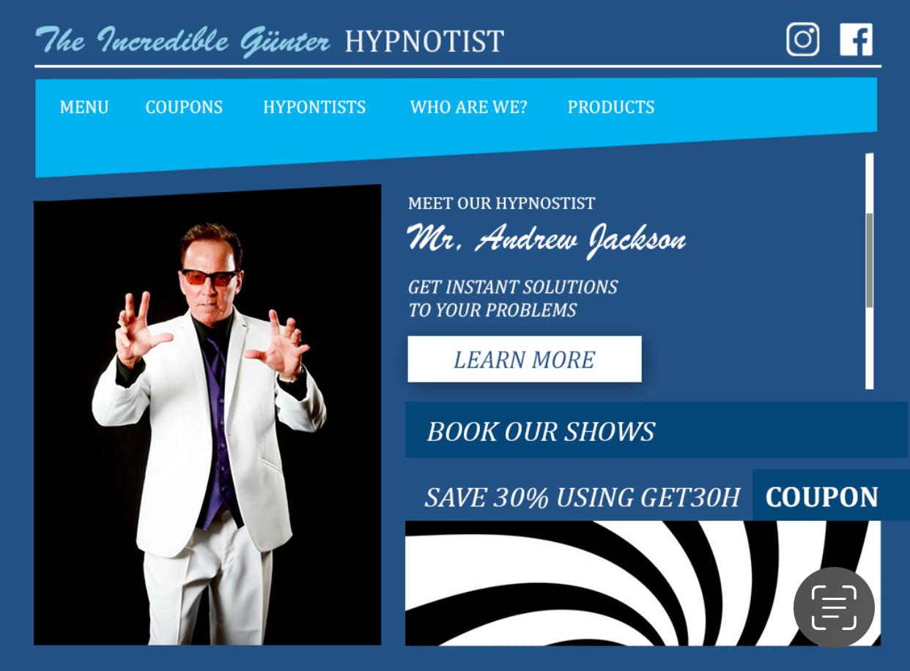

# LION DEN
Name=Gurpreet Singh
Student id =635259901

### Do showcase your skills with a minimum of three different wireframes for different domains.

Wireframes: A website wireframe, often called a screen blueprint, is a graphic illustration of a website's structural architecture. Wireframes are used to arrange components in the most efficient way to achieve a certain goal. A business goal and a creative concept are frequently the driving forces behind the goal. The wireframe displays the website's content page layout, including interface components and navigational mechanisms, as well as how they interact.

#### Wireframe - index

#### Wireframe - prices page

#### Wireframe - about page

#### Wireframe - contact page

### Do showcase responsive web design for different domains.

Responsive Web design: The goal of responsive web design is to create web pages that look great on any device. A responsive web design adjusts to changing screen sizes and viewports automatically. The use of HTML and CSS to automatically resize, conceal, reduce, or enlarge a website to make it seem excellent on all devices is known as responsive web design.

#### Tablet View

#### Mobile View

### Do showcase different tools[Adobe Photoshop/ Illustrator] expertise by mentioning it.
Adobe Photoshop: Adobe Photoshop is a great tool for creating and editing graphics for Windows and macOS developed and marketed by Adobe Inc.
With the help of Adobe Photoshop, the wireframes has been designed. One more design work created in photoshop has been published below: 

### Do showcase knowledge about HTML, CSS, JavaScript, Php and SQL by making one demo website.
HTML, or HyperText Markup Language, is the standardized markup language for texts that are intended to be viewed on a web browser. Technologies such as Cascading Style Sheets (CSS) and programming languages like JavaScript helps in making design and providing functionality to the HTML respectively.
The website in this repository - Lion Den is a showcase of my knowledge about the development skills.

### Share your soft skills via resume, which can be linked to your website.
My soft skills are:
- Stress management
- Active listening
- Good Verbal communication
- Logical reasoning
- Management skills
- Authenticity
- Networking
[Link to my resume](https://github.com/luckjossan/lion-den/blob/main/Soft%20skills%20resume.pdf)
